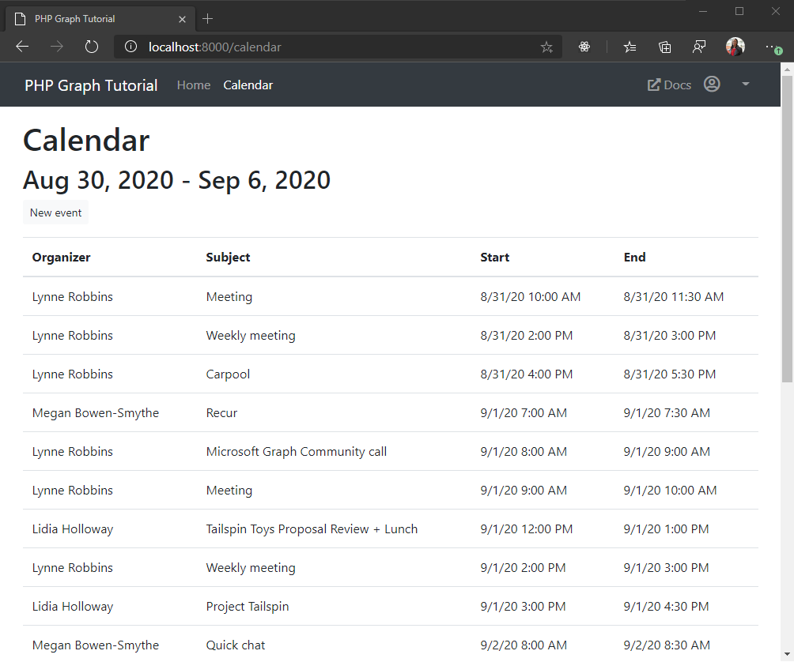

<!-- markdownlint-disable MD002 MD041 -->

<span data-ttu-id="6e6ea-101">Dans cet exercice, vous allez incorporer Microsoft Graph dans l’application.</span><span class="sxs-lookup"><span data-stu-id="6e6ea-101">In this exercise you will incorporate the Microsoft Graph into the application.</span></span> <span data-ttu-id="6e6ea-102">Pour cette application, vous allez utiliser la bibliothèque [Microsoft Graph](https://github.com/microsoftgraph/msgraph-sdk-php) pour passer des appels à Microsoft Graph.</span><span class="sxs-lookup"><span data-stu-id="6e6ea-102">For this application, you will use the [microsoft-graph](https://github.com/microsoftgraph/msgraph-sdk-php) library to make calls to Microsoft Graph.</span></span>

## <a name="get-calendar-events-from-outlook"></a><span data-ttu-id="6e6ea-103">Récupérer les événements de calendrier à partir d’Outlook</span><span class="sxs-lookup"><span data-stu-id="6e6ea-103">Get calendar events from Outlook</span></span>

1. <span data-ttu-id="6e6ea-104">Créez un répertoire dans le répertoire **./app** nommé `TimeZones` , puis créez un fichier dans ce répertoire nommé `TimeZones.php` et ajoutez le code suivant.</span><span class="sxs-lookup"><span data-stu-id="6e6ea-104">Create a new directory in the **./app** directory named `TimeZones`, then create a new file in that directory named `TimeZones.php`, and add the following code.</span></span>

    :::code language="php" source="../demo/graph-tutorial/app/TimeZones/TimeZones.php":::

    <span data-ttu-id="6e6ea-105">Cette classe implémente un mappage simpliste des noms des fuseaux horaires Windows aux identificateurs de fuseau horaire IANA.</span><span class="sxs-lookup"><span data-stu-id="6e6ea-105">This class implements a simplistic mapping of Windows time zone names to IANA time zone identifiers.</span></span>

1. <span data-ttu-id="6e6ea-106">Créez un fichier dans le répertoire **./app/http/Controllers** nommé `CalendarController.php` et ajoutez le code suivant.</span><span class="sxs-lookup"><span data-stu-id="6e6ea-106">Create a new file in the **./app/Http/Controllers** directory named `CalendarController.php`, and add the following code.</span></span>

    ```php
    <?php

    namespace App\Http\Controllers;

    use App\Http\Controllers\Controller;
    use Illuminate\Http\Request;
    use Microsoft\Graph\Graph;
    use Microsoft\Graph\Model;
    use App\TokenStore\TokenCache;
    use App\TimeZones\TimeZones;

    class CalendarController extends Controller
    {
      public function calendar()
      {
        $viewData = $this->loadViewData();

        $graph = $this->getGraph();

        // Get user's timezone
        $timezone = TimeZones::getTzFromWindows($viewData['userTimeZone']);

        // Get start and end of week
        $startOfWeek = new \DateTimeImmutable('sunday -1 week', $timezone);
        $endOfWeek = new \DateTimeImmutable('sunday', $timezone);

        $queryParams = array(
          'startDateTime' => $startOfWeek->format(\DateTimeInterface::ISO8601),
          'endDateTime' => $endOfWeek->format(\DateTimeInterface::ISO8601),
          // Only request the properties used by the app
          '$select' => 'subject,organizer,start,end',
          // Sort them by start time
          '$orderby' => 'start/dateTime',
          // Limit results to 25
          '$top' => 25
        );

        // Append query parameters to the '/me/calendarView' url
        $getEventsUrl = '/me/calendarView?'.http_build_query($queryParams);

        $events = $graph->createRequest('GET', $getEventsUrl)
          // Add the user's timezone to the Prefer header
          ->addHeaders(array(
            'Prefer' => 'outlook.timezone="'.$viewData['userTimeZone'].'"'
          ))
          ->setReturnType(Model\Event::class)
          ->execute();

        return response()->json($events);
      }

      private function getGraph(): Graph
      {
        // Get the access token from the cache
        $tokenCache = new TokenCache();
        $accessToken = $tokenCache->getAccessToken();

        // Create a Graph client
        $graph = new Graph();
        $graph->setAccessToken($accessToken);
        return $graph;
      }
    }
    ```

    <span data-ttu-id="6e6ea-107">Que fait ce code ?</span><span class="sxs-lookup"><span data-stu-id="6e6ea-107">Consider what this code is doing.</span></span>

    - <span data-ttu-id="6e6ea-108">L’URL qui sera appelée est `/v1.0/me/calendarView`.</span><span class="sxs-lookup"><span data-stu-id="6e6ea-108">The URL that will be called is `/v1.0/me/calendarView`.</span></span>
    - <span data-ttu-id="6e6ea-109">Les `startDateTime` `endDateTime` paramètres et définissent le début et la fin de l’affichage.</span><span class="sxs-lookup"><span data-stu-id="6e6ea-109">The `startDateTime` and `endDateTime` parameters define the start and end of the view.</span></span>
    - <span data-ttu-id="6e6ea-110">Le `$select` paramètre limite les champs renvoyés pour chaque événement à ceux que l’affichage utilise réellement.</span><span class="sxs-lookup"><span data-stu-id="6e6ea-110">The `$select` parameter limits the fields returned for each events to just those the view will actually use.</span></span>
    - <span data-ttu-id="6e6ea-111">Le `$orderby` paramètre trie les résultats en fonction de la date et de l’heure de leur création, avec l’élément le plus récent en premier.</span><span class="sxs-lookup"><span data-stu-id="6e6ea-111">The `$orderby` parameter sorts the results by the date and time they were created, with the most recent item being first.</span></span>
    - <span data-ttu-id="6e6ea-112">Le `$top` paramètre limite les résultats à 25 événements.</span><span class="sxs-lookup"><span data-stu-id="6e6ea-112">The `$top` parameter limits the results to 25 events.</span></span>
    - <span data-ttu-id="6e6ea-113">L' `Prefer: outlook.timezone=""` en-tête entraîne l’ajustement des heures de début et de fin dans la réponse au fuseau horaire préféré de l’utilisateur.</span><span class="sxs-lookup"><span data-stu-id="6e6ea-113">The `Prefer: outlook.timezone=""` header causes the start and end times in the response to be adjusted to the user's preferred time zone.</span></span>

1. <span data-ttu-id="6e6ea-114">Mettez à jour les itinéraires dans **./routes/Web.php** pour ajouter un itinéraire à ce nouveau contrôleur.</span><span class="sxs-lookup"><span data-stu-id="6e6ea-114">Update the routes in **./routes/web.php** to add a route to this new controller.</span></span>

    ```php
    Route::get('/calendar', 'CalendarController@calendar');
    ```

1. <span data-ttu-id="6e6ea-115">Connectez-vous, puis cliquez sur le lien **calendrier** dans la barre de navigation.</span><span class="sxs-lookup"><span data-stu-id="6e6ea-115">Sign in and click the **Calendar** link in the nav bar.</span></span> <span data-ttu-id="6e6ea-116">Si tout fonctionne, vous devriez voir une image mémoire JSON des événements dans le calendrier de l’utilisateur.</span><span class="sxs-lookup"><span data-stu-id="6e6ea-116">If everything works, you should see a JSON dump of events on the user's calendar.</span></span>

## <a name="display-the-results"></a><span data-ttu-id="6e6ea-117">Afficher les résultats</span><span class="sxs-lookup"><span data-stu-id="6e6ea-117">Display the results</span></span>

<span data-ttu-id="6e6ea-118">Vous pouvez désormais ajouter une vue pour afficher les résultats de façon plus parlante.</span><span class="sxs-lookup"><span data-stu-id="6e6ea-118">Now you can add a view to display the results in a more user-friendly manner.</span></span>

1. <span data-ttu-id="6e6ea-119">Créez un fichier dans le répertoire **./Resources/views** nommé `calendar.blade.php` et ajoutez le code suivant.</span><span class="sxs-lookup"><span data-stu-id="6e6ea-119">Create a new file in the **./resources/views** directory named `calendar.blade.php` and add the following code.</span></span>

    :::code language="php" source="../demo/graph-tutorial/resources/views/calendar.blade.php" id="CalendarSnippet":::

    <span data-ttu-id="6e6ea-120">Cela permet de parcourir une collection d’événements et d’ajouter une ligne de tableau pour chacun d’eux.</span><span class="sxs-lookup"><span data-stu-id="6e6ea-120">That will loop through a collection of events and add a table row for each one.</span></span>

1. <span data-ttu-id="6e6ea-121">Supprimez la `return response()->json($events);` ligne de l' `calendar` action dans **./app/http/Controllers/CalendarController.php**et remplacez-la par le code suivant.</span><span class="sxs-lookup"><span data-stu-id="6e6ea-121">Remove the `return response()->json($events);` line from the `calendar` action in **./app/Http/Controllers/CalendarController.php**, and replace it with the following code.</span></span>

    ```php
    $viewData['events'] = $events;
    return view('calendar', $viewData);
    ```

1. <span data-ttu-id="6e6ea-122">Actualisez la page et l’application doit maintenant afficher un tableau d’événements.</span><span class="sxs-lookup"><span data-stu-id="6e6ea-122">Refresh the page and the app should now render a table of events.</span></span>

    
