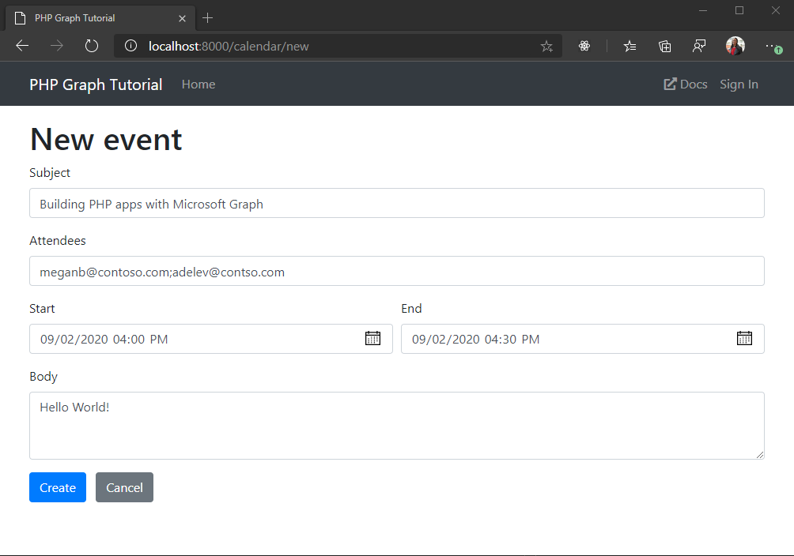

<!-- markdownlint-disable MD002 MD041 -->

<span data-ttu-id="76526-101">Dans cette section, vous allez ajouter la possibilité de créer des événements dans le calendrier de l’utilisateur.</span><span class="sxs-lookup"><span data-stu-id="76526-101">In this section you will add the ability to create events on the user's calendar.</span></span>

## <a name="create-new-event-form"></a><span data-ttu-id="76526-102">Créer un formulaire d’événement</span><span class="sxs-lookup"><span data-stu-id="76526-102">Create new event form</span></span>

1. <span data-ttu-id="76526-103">Créez un fichier dans le répertoire **./Resources/views** nommé `newevent.blade.php` et ajoutez le code suivant.</span><span class="sxs-lookup"><span data-stu-id="76526-103">Create a new file in the **./resources/views** directory named `newevent.blade.php` and add the following code.</span></span>

    :::code language="php" source="../demo/graph-tutorial/resources/views/newevent.blade.php" id="NewEventFormSnippet":::

## <a name="add-controller-actions"></a><span data-ttu-id="76526-104">Ajouter des actions de contrôleur</span><span class="sxs-lookup"><span data-stu-id="76526-104">Add controller actions</span></span>

1. <span data-ttu-id="76526-105">Ouvrez **./app/http/Controllers/CalendarController.php** et ajoutez la fonction suivante pour afficher le formulaire.</span><span class="sxs-lookup"><span data-stu-id="76526-105">Open **./app/Http/Controllers/CalendarController.php** and add the following function to render the form.</span></span>

    :::code language="php" source="../demo/graph-tutorial/app/Http/Controllers/CalendarController.php" id="getNewEventFormSnippet":::

1. <span data-ttu-id="76526-106">Ajoutez la fonction suivante pour recevoir les données du formulaire lors de l’envoi de l’utilisateur et créer un événement dans le calendrier de l’utilisateur.</span><span class="sxs-lookup"><span data-stu-id="76526-106">Add the following function to receive the form data when the user's submits, and create a new event on the user's calendar.</span></span>

    :::code language="php" source="../demo/graph-tutorial/app/Http/Controllers/CalendarController.php" id="createNewEventSnippet":::

    <span data-ttu-id="76526-107">Examinez ce que fait ce code.</span><span class="sxs-lookup"><span data-stu-id="76526-107">Consider what this code does.</span></span>

    - <span data-ttu-id="76526-108">Il convertit l’entrée de champ participants en tableau d’objets [participants](https://docs.microsoft.com/graph/api/resources/attendee?view=graph-rest-1.0) Graph.</span><span class="sxs-lookup"><span data-stu-id="76526-108">It converts the attendees field input to an array of Graph [attendee](https://docs.microsoft.com/graph/api/resources/attendee?view=graph-rest-1.0) objects.</span></span>
    - <span data-ttu-id="76526-109">Il génère un [événement](https://docs.microsoft.com/graph/api/resources/event?view=graph-rest-1.0) à partir de l’entrée de formulaire.</span><span class="sxs-lookup"><span data-stu-id="76526-109">It builds an [event](https://docs.microsoft.com/graph/api/resources/event?view=graph-rest-1.0) from the form input.</span></span>
    - <span data-ttu-id="76526-110">Il envoie un billet au `/me/events` point de terminaison, puis redirige vers l’affichage Calendrier.</span><span class="sxs-lookup"><span data-stu-id="76526-110">It sends a POST to the `/me/events` endpoint, then redirects back to the calendar view.</span></span>

1. <span data-ttu-id="76526-111">Mettez à jour les itinéraires dans **./routes/Web.php** pour ajouter des itinéraires pour ces nouvelles fonctions sur le contrôleur.</span><span class="sxs-lookup"><span data-stu-id="76526-111">Update the routes in **./routes/web.php** to add routes for these new functions on the controller.</span></span>

    ```php
    Route::get('/calendar/new', 'CalendarController@getNewEventForm');
    Route::post('/calendar/new', 'CalendarController@createNewEvent');
    ```

1. <span data-ttu-id="76526-112">Enregistrez toutes vos modifications et redémarrez le serveur.</span><span class="sxs-lookup"><span data-stu-id="76526-112">Save all of your changes and restart the server.</span></span> <span data-ttu-id="76526-113">Utilisez le bouton **nouvel événement** pour accéder au nouveau formulaire d’événement.</span><span class="sxs-lookup"><span data-stu-id="76526-113">Use the **New event** button to navigate to the new event form.</span></span>

1. <span data-ttu-id="76526-114">Renseignez les valeurs du formulaire.</span><span class="sxs-lookup"><span data-stu-id="76526-114">Fill in the values on the form.</span></span> <span data-ttu-id="76526-115">Utiliser une date de début à partir de la semaine en cours.</span><span class="sxs-lookup"><span data-stu-id="76526-115">Use a start date from the current week.</span></span> <span data-ttu-id="76526-116">Sélectionnez **Créer**.</span><span class="sxs-lookup"><span data-stu-id="76526-116">Select **Create**.</span></span>

    

1. <span data-ttu-id="76526-118">Lorsque l’application redirige vers l’affichage Calendrier, vérifiez que votre nouvel événement est présent dans les résultats.</span><span class="sxs-lookup"><span data-stu-id="76526-118">When the app redirects to the calendar view, verify that your new event is present in the results.</span></span>
